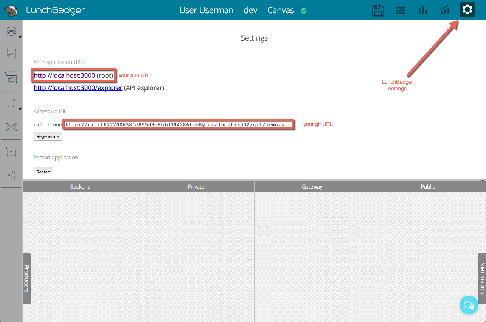

# OFF-CHAIN

[... based on Nick Dodson's ethjs implementation](https://github.com/ethjs/examples/blob/master/tictactoe.html)

# Getting started

This application utilizes [Metamask](www.metamask.io) to obtain wallet addresses, the [LoopBack framework](http://loopback.io/) for API composition and can be easily orchestrated and deployed using [LunchBadger](https://www.lunchbadger.com/). 

## Pre-requisites
* [Install the Metamask Chrome plugin](https://metamask.io/)
* Register for an account on [LunchBadger](https://www.lunchbadger.com/register)

## Installation steps
1. `git clone git@github.com:AdChain/tictactoe-loopback.git`
2. `npm install`
3. `npm start`
4. sign into Metamask to make sure your Ethereum account address is exposed
5. open two browser windows to [http://localhost:3000](http://localhost:3000)
6. check the option to play single player and begin game as player 1
7. play with yourself :stuck_out_tongue:

## Running on cloud (LunchBadger)
1. sign into [LunchBadger](https://www.lunchbadger.com/login)
2. open another browser window or tab and go to [https://app.lunchbadger.com](https://app.lunchbadger.com)
3. click the Cog icon to access settings and note:
	- the git url
	- the app url

	as shown below:
	
4. cd to tictactoe-loopback git directory
5. `git remote add lunchbadger [_YOUR GIT URL_]`
6. `git push lunchbadger master:master`
7. confirm notification dialogue appears on the LunchBadger canvas to reload
8. verify Canvas has rendered the tic-tac-toe microservices
9. click the Disk save icon on LunchBadger to sync all metadata in the Canvas
10. run tictactoe remotely - using [_YOUR APP URL_]
